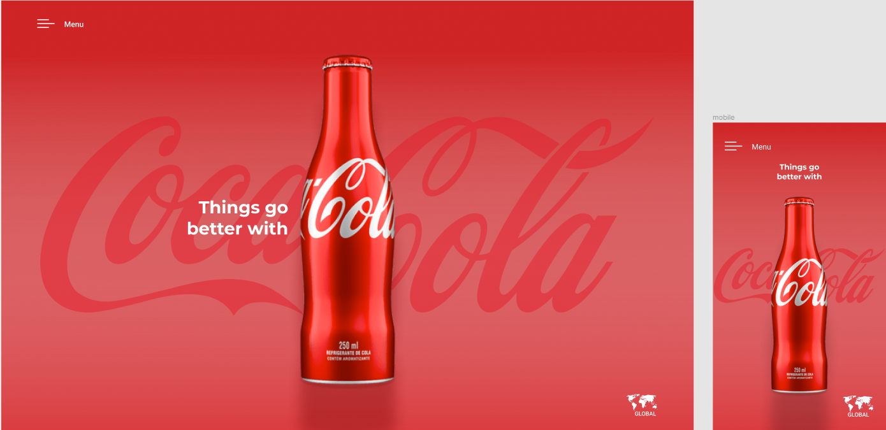

# Coke-page-layout

Site created with the didactic purpose for the PWFE classes of the Systems Development course at [SENAI Jandira](https://jandira.sp.senai.br/), about the guidance of professor [Fernando Leonid](https://github.com/fernandoleonid)

The project consists of developing a page in HTML and CSS according to the design given to us.

The project was designed considering also the responsiveness.

